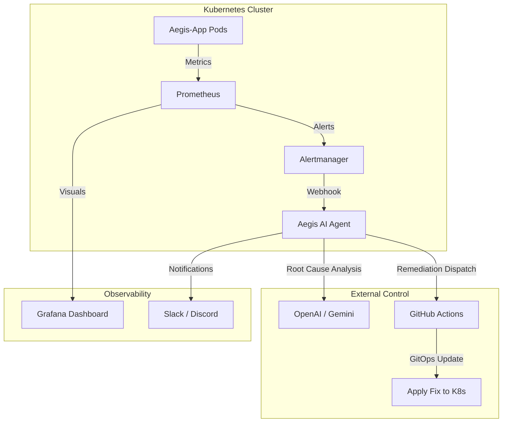

# 🛡️ Aegis-Ops: AI-Enhanced Self-Healing Infrastructure


Aegis-Ops is a next-generation "AIOps" pipeline that implements a fully autonomous, closed-loop self-healing infrastructure. It uses Prometheus for telemetry, an AI-powered agent for root cause analysis (RCA), and GitHub Actions for automated remediation.

---

## 🏗️ Architecture



---

## ✨ Key Features

- **⚡ Real-time Telemetry:** Full visibility into CPU, Memory, and Latency via Prometheus.
- **🧠 AI Root Cause Analysis:** An autonomous agent that reads pod logs and metadata to diagnose failures.
- **🛠️ Automated Remediation:** Zero-touch fixes including Scaling, Restarts, and Rollbacks.
- **📊 Professional Dashboards:** Pre-configured Grafana dashboards for executive-level observability.
- **🌪️ Chaos Engineering:** Built-in chaos endpoints to simulate real-world failure scenarios.

---

## 🛠️ Tech Stack

- **Core:** Kubernetes (Minikube/EKS/GKE)
- **Monitoring:** Prometheus & Alertmanager
- **Visualization:** Grafana
- **AI Agent:** Python (FastAPI), OpenAI GPT-4 / Gemini Pro
- **Remediation:** GitHub Actions (GitOps)
- **Application:** FastAPI (Python)

---

## 🚀 The Chaos Demo Guide

Want to see Aegis-Ops in action? Trigger these failure scenarios and watch the system heal itself:

### 1. The CPU Spike
```powershell
Invoke-RestMethod -Method POST http://localhost:8000/chaos/cpu-spike?duration=60
```
*   **Result:** AI detects throttling and triggers a `scale_up` action.

### 2. The Memory Leak
```powershell
Invoke-RestMethod -Method POST http://localhost:8000/chaos/memory-leak
```
*   **Result:** AI identifies a potential leak and triggers a `restart` to clear the cache.

### 3. The Latency Gauntlet
```powershell
Invoke-RestMethod -Method POST http://localhost:8000/chaos/latency?seconds=5
```
*   **Result:** AI detects slow responses and scales out the replica set to handle the perceived load.

---

## 📊 Observability

Access your "Command Center" at `http://localhost:3000`.
- **User:** `admin`
- **Password:** `aegis-ops-2024`

---

## 📜 License

Distributed under the MIT License. See `LICENSE` for more information.

---

**Developed by Durga Prasad** | Powered by Aegis-Ops Engine
